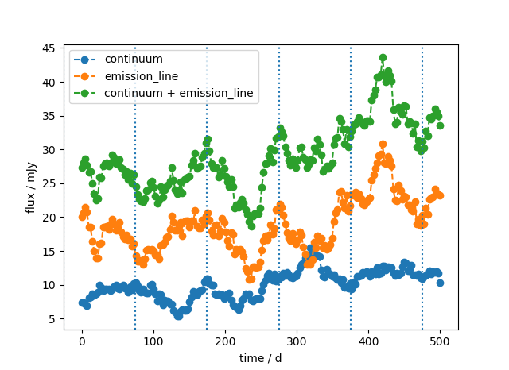

# Reverberation Mapping Light curves

In reverberation mapping, we take advantage of the fact that the light from an AGN takes some time to travel to the
surrounding broadline region, which then re-processes the light into a delayed echo.

We use this delay to work out the mass of the black hole.

Here we will just simulate the light curves for the broadline region (e.g. $H\beta$) and the central continuum
(e.g. in SDSS-I band).

The task is to make a function that simulates the light curves detected in $H\beta$ and SDSS-I bands.

* The $SDSS-I$ band will only detect a flat continuum (we will generate this by a gaussian process)
* The $H\beta$ band will detect both the continuum and the delayed $H\beta$ emission line from the Broad-Line Region
* There are 6 parameters involved here: observation times $t$, lag $T$, mean continuum flux $f$, the ratio of line to continuum flux $s$,
and the Gaussian Process parameters scaling $\tau$ and amplitude $\sigma$.

# Steps
1. Make a light curve generated from a Gaussian Process which varies around 10mJy
    * The Gaussian Process has 2 parameters: the scale $\tau$ (how quickly it varies) and the amplitude $\sigma$ (how
      much it varies).
    * The next step in the light curve is $x_{i+1} = \alpha x_i + \epsilon_i$,
      where $\alpha = e^{-|t_{i+1} - t{i}| / \tau}$,
    * and $\epsilon$ is the gaussian deviation with variance $= \sigma^2 (1 - e^{-2|t_{i+1} - t{i}| / \tau})$
    * This light curve will then be varying around 0.
    * Add on the mean continuum flux
    * This is the central continuum light curve
2. Lag that light curve by a time $T$ and multiply it by the line scale $s$. This is the intrinsic broadline emission
light curve.
3. Now add the the intrinsic broadline emission to the continuum emission. This is the detected SDSS-I band emission.

# Coding
1. Write your solution inside `solution.py`
2. Run `python run.py` to check that your solution works

Your solution should look something like:
